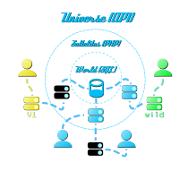

LiquidMS hosting model
======================

LiquidMS is able to mirror server listings of any API-compliant SRB2 HTTP
V1 master server within it's own server database. This is called the
"superset mirror" concept and needs to be kept in mind when hosting a
LiquidMS node. Furthermore, to allow for load balanced network
architectures and maximum possible uptime, LiquidMS was designed with three
layers of operation in mind:

1. The ODBC Database or *World* at the core. Think of it as the model to
   LiquidMS, being responsible for managing all hosted data. For security,
   we deliberately left management of world rooms and banned servers to the
   database server administrator as to guarantee consistency across a
   LiquidMS network in terms of authorization and API I/O.
2. LiquidMS nodes, otherwise known as *sattelites* provide an HTTP API for
   supplying and managing the master server service. These nodes can also
   be used for fetching universe netgames into the ODBC database, although
   database access authorization is needed for operation. More on the
   concept of fetching down below.
3. *Universe servers* and *snitches* provide LiquidMS nodes and by
   extension the database with external universewide netgame data to be
   mirrored. More on the concept of snitching down below.

If you wanna define custom local ("world") rooms on your node, you must
register these in their database with an ID between 2 and 99, either
manually or through `tables.sql`. This is a deliberate security measure to
avoid unauthorized remote database fiddling in distributed setups. Room ID
1 is reserved for World and remains ignored.

